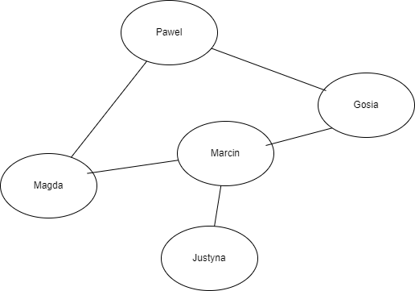
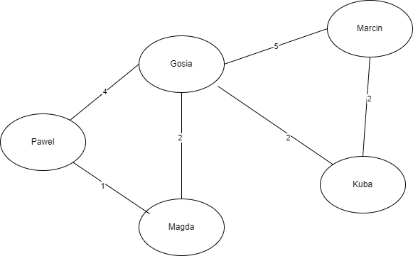

<!--Category:C#,SQL--> 
 <p align="right">
    <a href="http://productivitytools.tech/productivitytools-createsqlserverdatabase/"><a> 
    <a href="https://github.com/ProductivityTools-Learning/ProductivityTools.Example.GCP.SecretManager"></a>
</p>
<p align="center">
    <a href="http://http://productivitytools.tech/">
        
    </a>
</p>


# Algorithms

Repository is used to store different coding quest.
[Draw.io file](https://app.diagrams.net/#G1z-c3mN3V7xB3Kej71jyUp6bZdj1GPvhg)

<!--more-->

## BFS
It shows how to do BFS with the undirected graph. Objects could have connections beteen each over A has reference to B, and B has reference to A. Connections are not weighted.

BFS cannot be used to find the shortest path. Dijkstra's algorithm adapts BFS to let you find single-source shortest paths.

To print the path from one node to the node which we had been looking for, we need to save reference to parent.

BFS we are usually doing with the Queue and the while. We are adding all nodes on given level to the queue and while queue is not empty we are processing elements




## DFS

- **Important** difficult part is returning value and poping in right place

```c#
Visited.Add(node);
Path.Push(node);
if (node.Name == lookUpValue)
{
    return node;
}
else
{
    foreach (var childNode in node.Nodes)
    {
        if (Visited.Contains(childNode) == false)
        {
            var result=Search(childNode, lookUpValue);
            if (result == null)
            {
                Path.Pop();
            }
        }
    }
    return null;
}
```

### BFS vs DFS
||BFS|DFS|
|--|---|---|
|Working object|Node contains node|Node contains node|
|Working function|NodeQueue|Recursion|
|Path object|ChildParentDictionary|Stack

## Dijkstra

- We need to have nodes and the edges. Edge needs to contain From and To Node reference
- Weights cannot be negative



## MST Prim

- Do it also with the array instead of names
- Performed for the same graph as Djkstra

### Comparing Prim’s and Dijkstra’s Algorithms
In the computation aspect, Prim’s and Dijkstra’s algorithms have three main differences:

- Dijkstra’s algorithm finds the shortest path, but Prim’s algorithm finds the MST
- Dijkstra’s algorithm can work on both directed and undirected graphs, but Prim’s algorithm only works on undirected graphs
- Prim’s algorithm can handle negative edge weights, but Dijkstra’s algorithm may fail to accurately compute distances if at least one negative edge weight exists

In practice, Dijkstra’s algorithm is used when we want to save time and fuel traveling from one point to another. Prim’s algorithm, on the other hand, is used when we want to minimize material costs in constructing roads that connect multiple points to each other.

|Dijkstra|Prim|Kruskal|
|---|---|---|
|EdgePriorityQueue|EdgePriorityQuene|EdgePriorityQuene|
|NodesVisitedHashset|NodesVistedHashset|QuickUnion<Node>|
|DistanceToDictionary|EdgeMSTList|MST| 


### Learning
|Date|BFS|DFS|MSTPrim|MSTKruskal|Dijsktra|QuickSort|
|---|---|---|---|---|---|---|
|2022.10.10|||||||
|2022.10.11||||||


Learnings from learning:
- BFS/DFS is used to not directed not weight graph, that is why we need queue<Node> not edge priority queue
- Always be sure if we are talking about graph or a tree, if graph, we need to have Visited structure
- Dijkstra is to finding the distance to